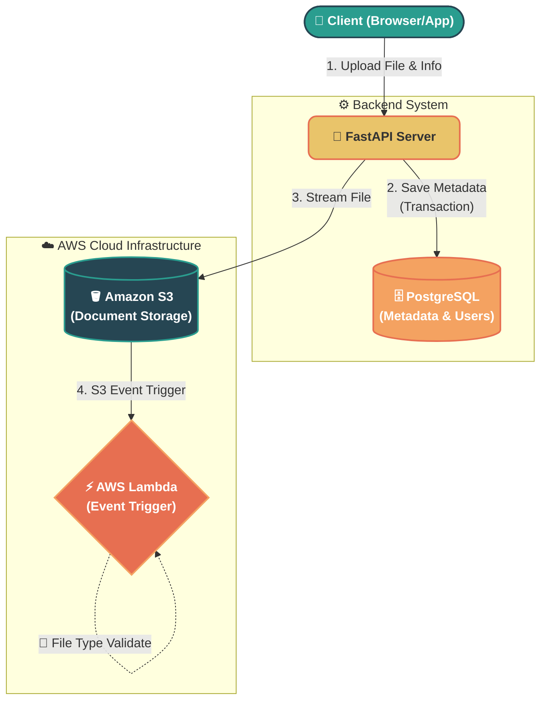

# 📂 ShareYou Dashboard


A high-performance project management and file-sharing dashboard. Create projects, invite participants, and securely manage your documents with cloud-native AWS integrations.

---

## 🏗️ Architecture

Below is the visual architecture of the document upload flow.

> **🔍 Tip:** *Click on the diagram to expand and zoom in GitHub.*



### 🔁 The Document Upload Flow
1. **Client Request:** The user uploads a file via the client interface.
2. **Backend Processing:** The FastAPI server receives the request, validates permissions (JWT), and saves document metadata in PostgreSQL.
3. **Cloud Storage:** Simultaneously, the file is streamed to the AWS S3 Bucket.
4. **Lambda Triggers:** Once the file lands in S3, it triggers an AWS Lambda function that asynchronously performs deep validation (Antivirus scanning, accurate size recalculation, and deep MIME-type verification).

---

## 🚀 Quick Start

Ensure you have [Docker](https://www.docker.com/) and [Docker Compose](https://docs.docker.com/compose/) installed on your machine.

### 🛠 Makefile Commands

We use a `Makefile` to simplify daily development tasks.

| Command | Description |
| :--- | :--- |
| `make up` | 🟢 Starts the application and database in the background. |
| `make down` | 🔴 Stops and removes the Docker containers. |
| `make build` | 🏗️ Rebuilds the Docker images and starts the containers. |
| `make logs` | 📜 Tails the logs of the running containers in real-time. |
| `make migrate` | 🗃️ Runs Alembic to apply the latest database migrations. |
| `make makemigrations`| 📝 Auto-generates a new Alembic migration based on model changes. |
| `make test` | 🧪 Runs the `pytest` suite and displays test coverage. |
| `make lint` | 🧹 Runs `flake8` to check code for style violations. |
| `make format` | ✨ Auto-formats code using `black` and `isort`. |

### 🏁 Running Locally

1. **Clone the repository & setup `.env`** (ensure your AWS keys and DB credentials are set).
2. **Start the services:**
   ```bash
   make up
   ```
3. **Apply Database Migrations:**
   ```bash
   make migrate
   ```
4. **Access the API:**
   - Swagger UI: [http://localhost:8000/docs](http://localhost:8000/docs)
   - ReDoc: [http://localhost:8000/redoc](http://localhost:8000/redoc)

---

## 🔒 Security & Roles
- **Owner**: The creator of a project. Has full control (Update, Delete, Manage Members, Upload Documents).
- **Participant**: Invited members. Can view, upload, and update project info/documents, but **cannot delete** them.
- All secure endpoints require a **JWT Bearer Token** (valid for 1 hour).
